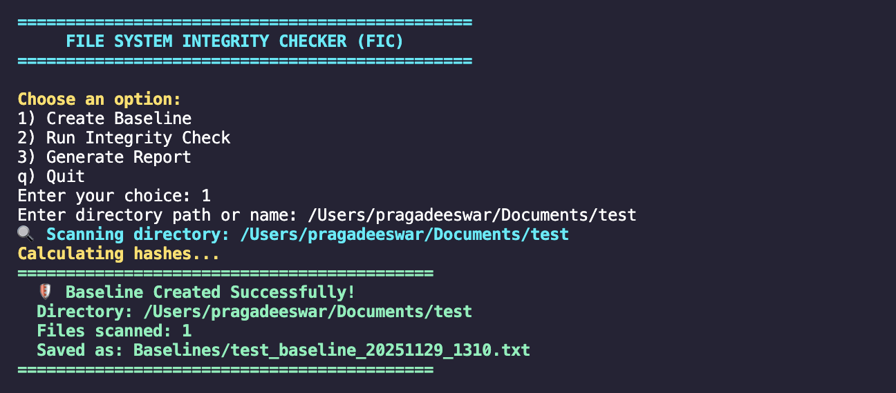
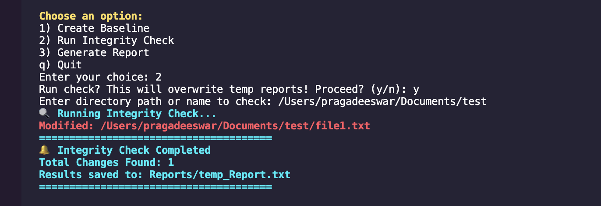
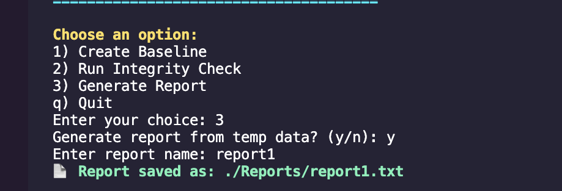

# 🛡️ File Integrity Checker — Bash (FIC)

A lightweight **File Integrity Monitoring (FIM)** tool developed in Bash for detecting unauthorized modifications to critical system files.  
Uses **SHA-256 hashing** to ensure system file security by identifying additions, deletions, and tampering.

---

## 🔍 Why File Integrity Checking?

Attackers often modify system files to:

- Insert malware or backdoors
- Elevate privileges
- Hide malicious processes

This tool helps detect such activities by comparing **current file states vs. trusted baselines**.

---

## 🚀 Features

| Feature | Status |
|--------|:------:|
| Baseline creation using SHA-256 hashes | ✔️ |
| Detect modified system files | ✔️ |
| Detect added/removed files | ✔️ |
| Real-time alerts in terminal | ✔️ |
| Report generation as a text file | ✔️ |
| Fully CLI-based & lightweight | ✔️ |
| Works on macOS & Linux | ✔️ |

---

## 🏗️ Project Structure

## 📸 Screenshots & Output Demo

### 1️⃣ Create Baseline

### 2️⃣ Integrity Check - No Changes Detected

### 3️⃣ Integrity Check - Modified File Detected

### 4️⃣ Report Generated

